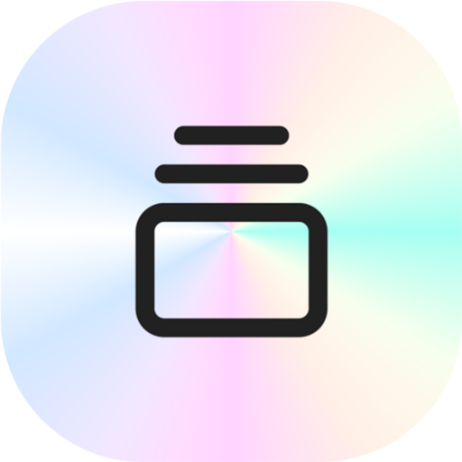
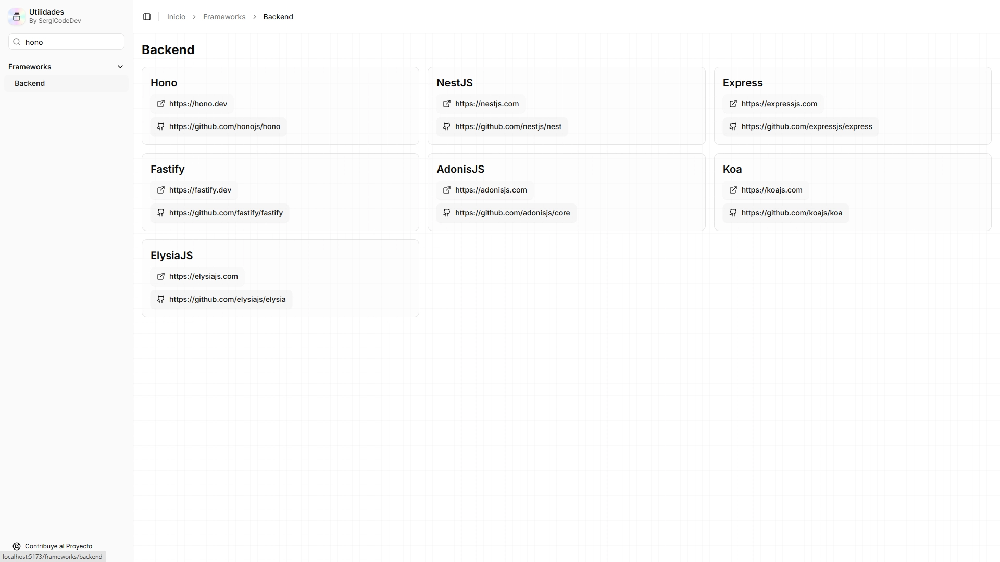

#  Utilidades

[]() []() []() []() []()

## Inicio:


> [!NOTE]
> Puedes visitar esta página en el siguiente enlace: [https://utilidades.pages.dev](https://utilidades.pages.dev/)

## Página:


## Buscador:



## ¿Cómo crear tu propia web de utilidades o contribuir? Guía paso a paso

1. **Requisitos**: Necesitas tener instalado Node.js v20+.

2. **Instalar las dependencias**: Para que el proyecto funcione correctamente.

   ```bash
   npm i
   ```

3. **Desarrollo**: Inicia el servidor en modo desarrollo.

   ```bash
   npm run dev
   ```

   Tu aplicación estará disponible en `http://localhost:5173`.

4. **Personalización**: Edita el archivo de categorías:

   ```typescript
   // app/data/categories.ts
   export const categories: Category[] = [
     // otros
     {
       title: 'Nombre Categoría',
       url: '/ruta', // nombre-categoria
       items: [
         {
           title: 'Subcategoría',
           url: '/ruta', // subcategoria (/nombre-categoria/subcategoria)
           data: [
             {
               title: 'Nombre Herramienta',
               web: 'URL', // Opcional
               github: 'URL', // Opcional
             },
           ],
         },
         // otros
       ],
     },
     // otros
   ]
   ```

5. **\*Build para producción**: Genera una build optimizada.

   ```bash
   npm run build
   ```

6. **Despliegue**: Una vez realizada la build, puedes acceder a `build/client/` y subir la carpeta `client` directamente a Cloudflare Pages.

   ### Despliegue desde Docker (Opcional)

   Este template incluye tres Dockerfiles para diferentes gestores de paquetes:

   - `Dockerfile` - para npm
   - `Dockerfile.pnpm` - para pnpm
   - `Dockerfile.bun` - para bun

   Para construir y ejecutar con Docker:

   ```bash
   # Para npm
   docker build -t my-app .

   # Para pnpm
   docker build -f Dockerfile.pnpm -t my-app .

   # Para bun
   docker build -f Dockerfile.bun -t my-app .

   # Ejecutar el contenedor
   docker run -p 3000:3000 my-app
   ```

   La aplicación en contenedor puede desplegarse en cualquier plataforma que soporte Docker, incluyendo:

   - AWS ECS
   - Google Cloud Run
   - Azure Container Apps
   - Digital Ocean App Platform
   - Fly.io
   - Railway

   ### DIY Deployment

   Si estás familiarizado con desplegar aplicaciones Node, el servidor integrado está listo para producción.

   Asegúrate de desplegar el resultado de `npm run build`:

   ```
   ├── package.json
   ├── package-lock.json (o pnpm-lock.yaml, o bun.lockb)
   ├── build/
   │   ├── client/    # Assets estáticos
   │   └── server/    # Código del servidor
   ```

## Contribuciones

Este proyecto está disponible para su mejora. Si tienes sugerencias o deseas contribuir:

1. Abre un **Pull Request** con tus cambios.
2. Reporta problemas mediante **Issues** en el repositorio.
3. Mantén el formato existente en `categories.ts`.
4. Verifica que todos los enlaces funcionen correctamente.

---

¡Gracias por usar esta web! Esperamos que te facilite la vida en el desarrollo web. 🚀
